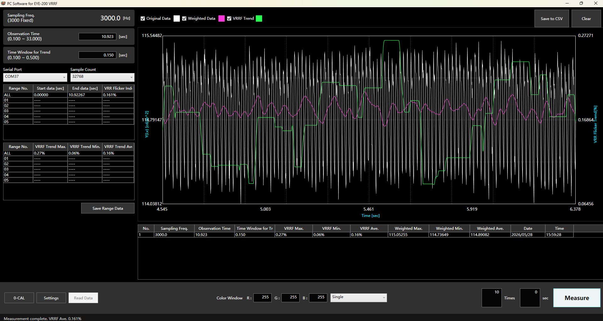

# EYE-200 VRRF Measurement GUI

[中文说明](./README.md)



This is a .NET 8 WPF GUI application for EYE-200 probe VRRF measurement. It controls the probe over a serial port, captures luminance waveforms, applies a fixed 901-tap causal FIR model to calculate `Weighted Data`, then calculates VRRF Trend with a 0.150 s trailing window.

## Features

- Serial measurement with local COM port enumeration. `COM37` is preferred by default when available.
- Sample counts: `64, 128, 256, 512, 1024, 2048, 4096, 8192, 16384, 32768`.
- Measurement modes: `Single`, `Continuous`, and `Interval`.
- Progress dialog during measurement.
- Chart display for Original Data, Weighted Data, and VRRF Trend.
- Chart context menu: X-only zoom, Y-only zoom, auto fit, horizontal drag, and vertical drag.
- History table supports Excel-like cell selection and copy/paste into Excel.
- CSV export for point data, history summary, and range summary.
- Custom application icon and Windows x64 single-file publishing.

## Run

Run from source:

```powershell
cd "C:\sorce\document_now\diy\compile projects\EYE-VRRF"
dotnet run --project .\EyeVrrf.App\EyeVrrf.App.csproj
```

Published single-file executable:

```text
publish\win-x64-single\EyeVrrf.App.exe
```

## Build And Test

```powershell
dotnet build
dotnet test
```

If the GUI is already running, `dotnet build` may fail because the exe/dll is locked. Close `EyeVrrf.App.exe` and build again.

## Publish Single-File EXE

```powershell
dotnet publish .\EyeVrrf.App\EyeVrrf.App.csproj `
  -c Release `
  -r win-x64 `
  --self-contained true `
  -p:PublishSingleFile=true `
  -p:IncludeNativeLibrariesForSelfExtract=true `
  -p:DebugType=None `
  -p:DebugSymbols=false `
  -o .\publish\win-x64-single
```

The output folder will contain a single `EyeVrrf.App.exe`.

## Project Layout

```text
EyeVrrf.App      WPF GUI application
EyeVrrf.Core     Serial acquisition, VRRF calculation, CSV export
EyeVrrf.Tests    xUnit tests
```

## VRRF Calculation Notes

The algorithm is based on [cnbright/flk_calculator](https://github.com/cnbright/flk_calculator). This project ports the EYE-200 VRRF FIR weighting and Trend calculation flow to .NET 8.

- Time values: `Time [sec] = (index + 1) * interval / 3000`.
- Default base sampling rate: `3000 Hz`.
- FIR model: trained from the existing `V#1.csv` and embedded in `EyeVrrf.Core/VrrfFirModelData.cs`.
- Trend formula: `(max(weighted_window) - min(weighted_window)) / average(weighted_window) * 100`.
- Default Trend window: `0.150 s`.

Small sample counts can be used for waveform acquisition, but complete VRRF results require enough data for both the FIR model and the Trend window.

## Device Parameters

- Default port: `COM37`
- Baud rate: `115200`
- Serial format: 8N1
- Command sequence: `STR,0`, `WCS,...`, `FCS,2,0`, `MMS,2`, `MES,1`, `WDR,0`, `WDR,1..N`
